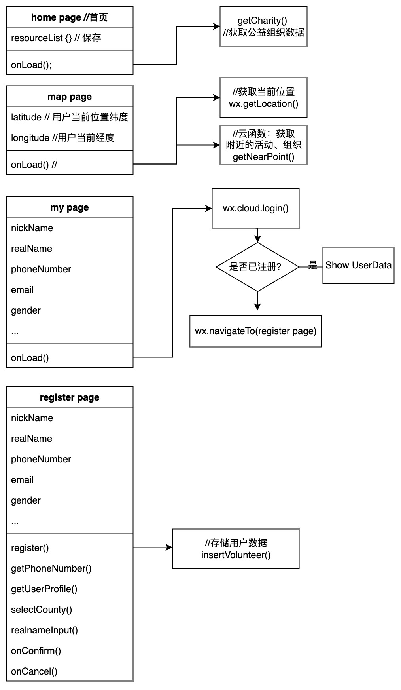
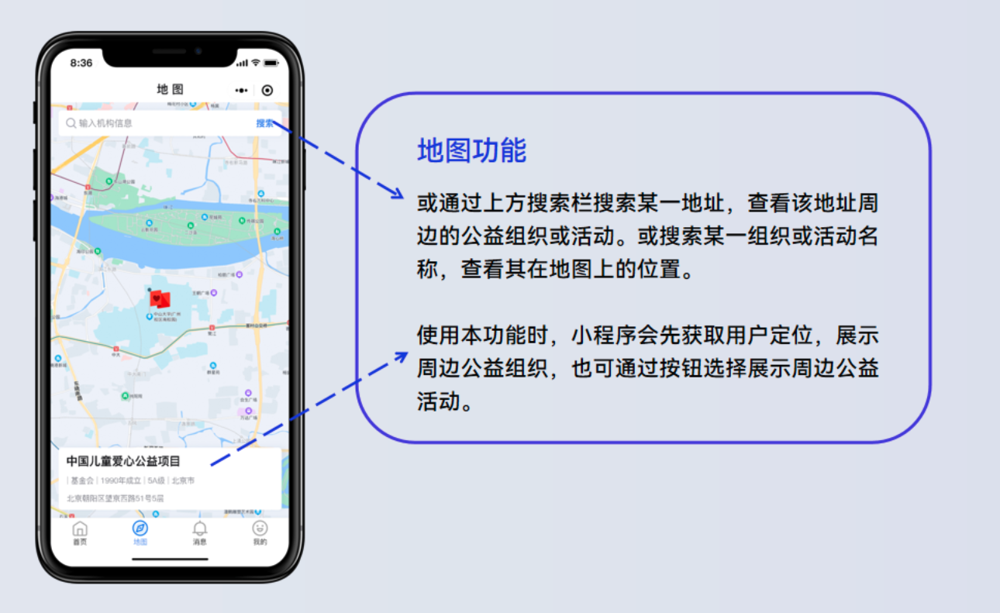
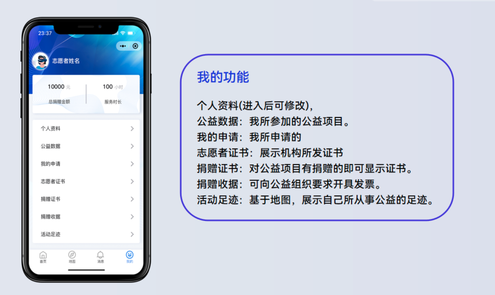
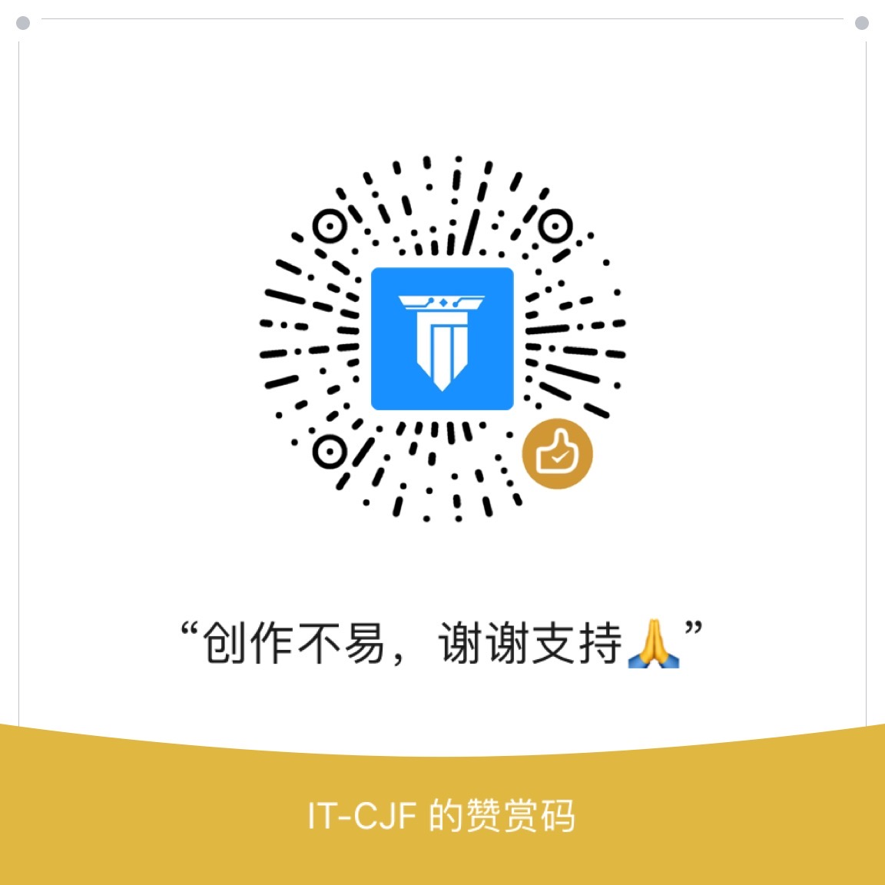

# shimmer-volunteer 微光志愿者小程序
<p align="center">
    
</p>

<!-- ALL-CONTRIBUTORS-BADGE:START - Do not remove or modify this section -->
[](#contributors-)
<!-- ALL-CONTRIBUTORS-BADGE:END -->

数云汇爱天地阔，微光奇烁志愿心。

## 项目介绍
> 本平台以腾讯云为主要技术支撑，集地图搜索与展示、数据报表生成与可视化、讯息发布与精准推送、用户注册认证与管理等功能于一体，专注于为公益团体及个人、有关监管部门、各界爱心人士等提供便捷、高效、安全的一体化服务。


## 功能需求
- 需求点1： 志愿者管理 -- 志愿者注册、志愿者登录、志愿者数据管理模块
- 需求点2：  团体管理 -- 团体注册、团体登录、团体数据管理模块
- 需求点3:    志愿活动 -- 志愿活动发布、志愿活动报名、志愿活动数据管理模块
- 需求点4:    地图找寻志愿组织、志愿活动 -- 利用志愿者当前位置，为用户推荐附近的志愿组织机构和已发布的志愿活动。该功能支持关键词分类查找、搜索。
- 需求点5:    消息管理 -- 用户和志愿组织可以使用消息模块进行聊天，实时沟通。

## 技术栈
- 产品开发主要使用腾讯云作为技术支撑：
- 云函数：用于业务后台；小程序内提供了专门用于云函数调用的 API。在云函数内使用 wx-server-sdk 提供的 getWXContext 方法获取到每次调用的上下文（appid、openid 等），无需维护复杂的鉴权机制，获取天然可信任的用户登录态（openid）。
- 云数据库: 存储业务数据 + 实时消息，配置索引加速查询；云开发提供了一个 JSON 数据库。
- 云存储：存储用户头像、获奖证书，参加活动现场打卡等；云开发提供了一块存储空间，提供了上传文件到云端、带权限管理的云端下载能力，我们可以在小程序端和云函数端通过 API 使用云存储功能。
- 访问服务：调用云函数直接使用微信云开发的API，会通过微信云函数的专属链路传输；
- 开发工具： 微信开发者工具；

## 系统设计图(部分)


## 功能界面

### 功能演示


### 首页


### 公益地图


### 消息


### 我的



## 快速上手

环境要求：Node.js >= 14

安装依赖：

```bash
yarn
```
打开[微信开发者工具](https://mp.weixin.qq.com/debug/wxadoc/dev/devtools/download.html)，把 `shimmer-volunteer` 目录添加进去就可以预览示例了。

## 基础库版本

使用基础库版本`^2.24.5`

## 预览
请使用微信扫码预览 ↓
<br/>


## 欢迎贡献
项目需要大家的支持，期待更多小伙伴的贡献，你可以：
- 提建议或 Bug：[反馈平台](https://support.qq.com/products/413347)
- 在 GitHub 上提交你的项目


## 联系作者


## 公益捐赠



## 致谢
IT-CJF 

## Contributors ✨

Thanks goes to these wonderful people ([emoji key](https://allcontributors.org/docs/en/emoji-key)):

<!-- ALL-CONTRIBUTORS-LIST:START - Do not remove or modify this section -->
<!-- prettier-ignore-start -->
<!-- markdownlint-disable -->
<table>
  <tr>
    <td align="center"><a href="https://blog.csdn.net/caijunfen"><br /><sub><b>腾讯全栈开发  IT-CJF</b></sub></a><br /><a href="https://github.com/liyupi/code-nav/commits?author=jwcjf" title="Code">💻</a></td>
   
  </tr>
</table>

<!-- markdownlint-restore -->
<!-- prettier-ignore-end -->

<!-- ALL-CONTRIBUTORS-LIST:END -->

This project follows the [all-contributors](https://github.com/all-contributors/all-contributors) specification. Contributions of any kind welcome!
